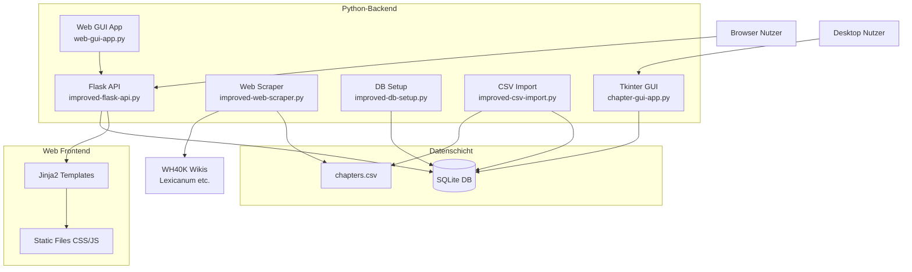

# Komponentendiagramm — WH40K Datenbank

```mermaid
graph TB
    subgraph Python-Backend ["Python-Backend"]
        Flask[Flask API\nimproved-flask-api.py]
        Scraper[Web Scraper\nimproved-web-scraper.py]
        DBSetup[DB Setup\nimproved-db-setup.py]
        CSVImport[CSV Import\nimproved-csv-import.py]
        TkGUI[Tkinter GUI\nchapter-gui-app.py]
        WebGUI[Web GUI App\nweb-gui-app.py]
    end

    subgraph Daten ["Datenschicht"]
        SQLite[(SQLite DB)]
        CSV[chapters.csv]
    end

    subgraph Frontend ["Web Frontend"]
        Templates[Jinja2 Templates]
        Static[Static Files CSS/JS]
    end

    Wiki[WH40K Wikis\nLexicanum etc.]
    Browser[Browser Nutzer]
    Desktop[Desktop Nutzer]

    Scraper --> Wiki
    Scraper --> CSV
    CSVImport --> CSV
    CSVImport --> SQLite
    DBSetup --> SQLite
    Flask --> SQLite
    Flask --> Templates
    Templates --> Static
    Browser --> Flask
    TkGUI --> SQLite
    Desktop --> TkGUI
    WebGUI --> Flask
```
